<h1 style="line-height:2;">
<a href="https://nexplayersdk.com/contact/" target="_blank"></img></a>
<a align=right href="https://nexplayersdk.com" target="_blank">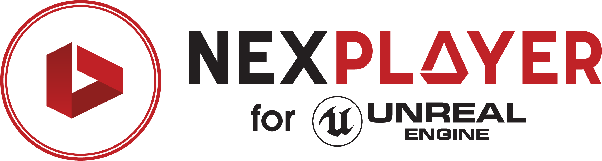</a>

</h1>
 

 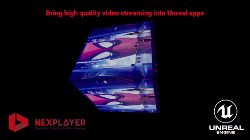</img>

NexPlayer™ for Unreal Engine is a cross-platform video streaming player for Unreal Engine apps that supports video playback across all Android, iOS, and Windows devices. NexPlayer's Unreal video plugin is the only player supporting HLS & DASH streaming on **all Android & iOS devices.**

This repository contains the NexPlayer™ Unreal Engine video streaming player plugin features list as well as an installation guide. If you want to get a copy of our fully working demo, contact us at our [website](https://nexplayersdk.com/).

## Table of Contents

* **[Features](#features)**  

* **[Supported Platforms](#supported-platforms)**

* **[Demo Installation Guide](#demo-installation-guide)**
 
   

 </img>

Our Unreal Engine video plugin allows for the introduction of new exciting levels within your Unreal Engine projects. With our plugin, you can use in-game actions and objects to modify video content.

## Features

The NexPlayer™ for Unreal Engine video streaming player plugin contains the latest features. As our Unreal Engine video plugin is developed entirely in-house, we can implement any desired functionalities. 

We support the following features:

<table>
 <tbody style="text-align:center;">
   <tr>
     <td valign="top" style="text-align:center;">
         
<b>Overview</b>

     </td>
     <td>
       <ul>
       <li>HLS & DASH Streaming with ABR (Adaptive Bitrate)</li>
       <li>Server-Side & Client-Side Ad Insertion</li>
       <li>Windows Editor (C++ & Blueprint)</li>
       <li>Up to 8K (UHD) Resolution</li>
       <li>Up to 60 Frames Per Second (FPS)</li>
       <li>Rendering Videos on 3D Objects</li>
       </ul>
     </td>
        <tr>
            <td valign="top" style="text-align:center;">
            
<b>Basic Features</b>

     </td>
     <td>
       <ul>
        <li>Auto Playback</li>
        <li>Open Video Content</li>
        <li>Play / Pause</li>
        <li>Stop</li>
        <li>Close</li>
       </ul>
     </td>
     </tr>
   </tr>
 </tbody>
</table>

## Supported Platforms

| Platform | Supported Graphics APIs | HLS | DASH | Local|
| :-----:| :-----:| :-----:| :-----:| :-----:|
| Android  | OpenGLES2, OpenGLES3 | :heavy_check_mark: | :heavy_check_mark: | :x:|
| iOS | Metal | :heavy_check_mark: | :heavy_check_mark: | :x: |
| Windows | DirectX11 / DirectX12 | :heavy_check_mark: | :heavy_check_mark: | :x:|

## Demo Installation Guide

### 1) Plugin Import

 Make sure that your Unreal Engine Project is closed. 

 Open the project's root directory (the one that includes the .uproject): 

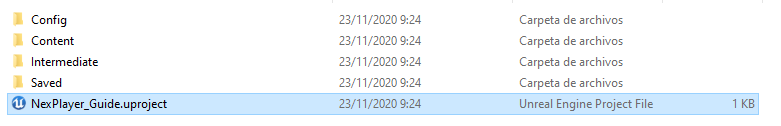</img>

 Create a Plugins folder if you don't have it, and unzip the NexPlayerUnreal SDK inside of it: 

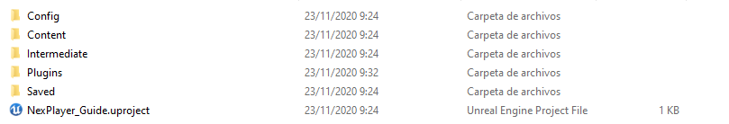</img>

 Open the  project, and open the Plugins Window:

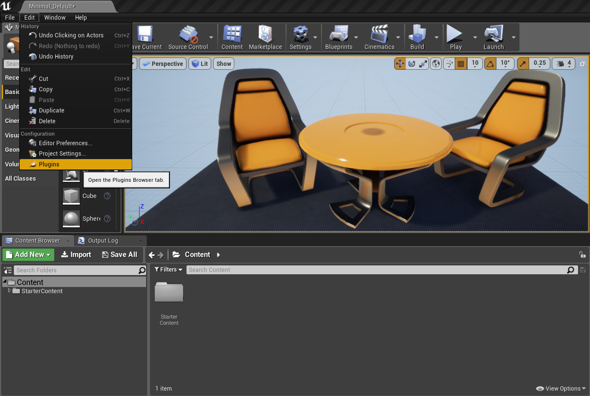</img>

 Scroll all the way down to the Project section and under the Video category, select NexPlayerUnreal and check Enabled: 

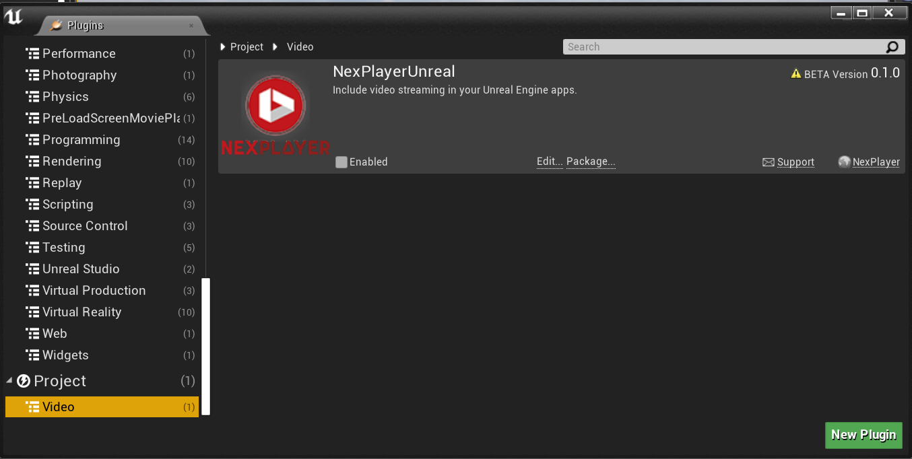</img>

 A yellow prompt will pop-up asking you to restart the editior, press the Restart Now button: 

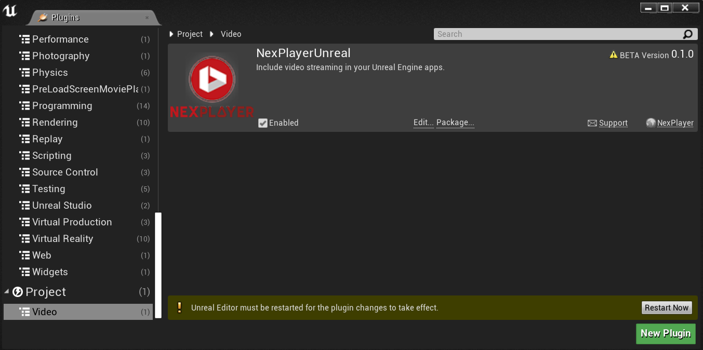</img>

 Unreal Engine will compile the plugin and open the project, with the plugin fully imported. 

### 2) Video Setup

 Add to the scene some basic Actor where the rendering will ocur. It needs to have the uvs properly set. We recomend a Plane or Shape cube (the regular primitive cube won't work because of it's UVs): 

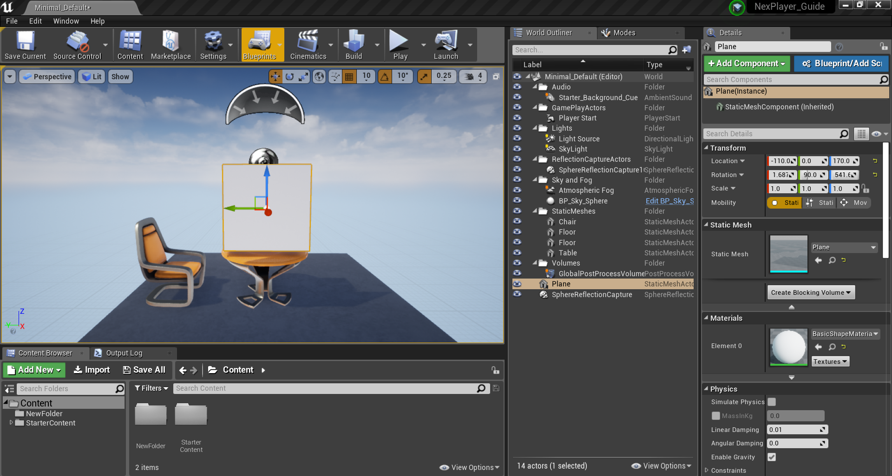</img> 

 Feel free to scale the Actor to match the desired video screen ratio (generally 16:9).
On the bottom right corner of the Content Browser, press View Options and make sure Show Plugin Content: 

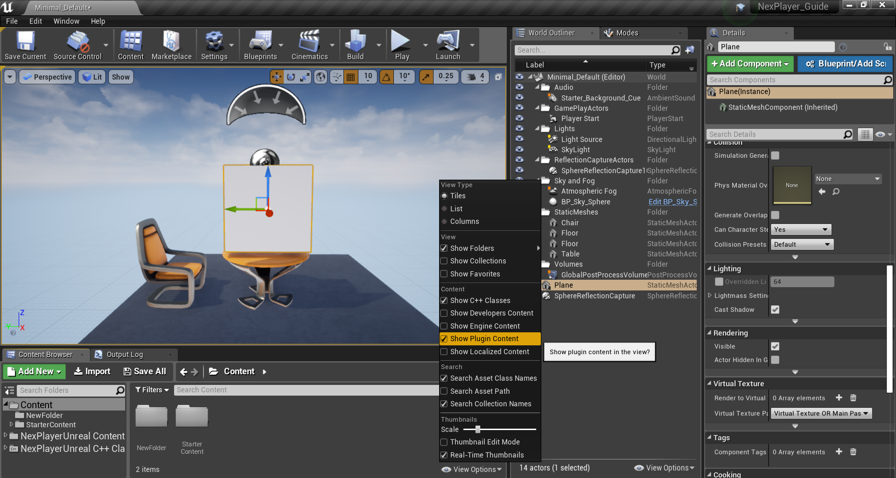</img> 

 Add the BP_NexPlayer Blueprint located in Content/Blueprints to the scene: 

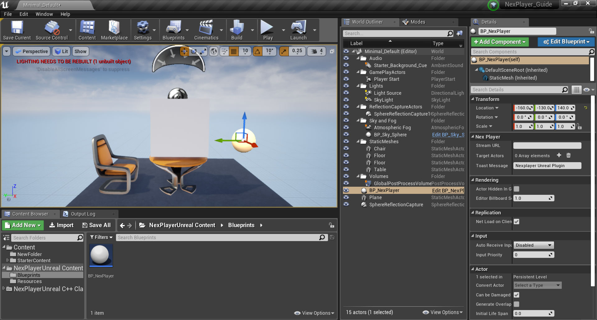</img> 

 Add the BP_NexPlayer Blueprint located in Content/Blueprints to the scene: 

</img> 

 Select the bP_NexPlayer Blueprint and Set Stream URL in the Details tab to select the video content url: 

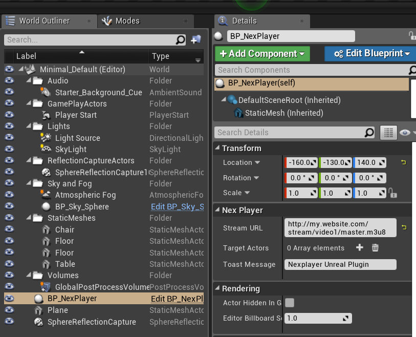</img> 

 Add one element to Target Actors in the Details tab and reference the Actor you added before: 

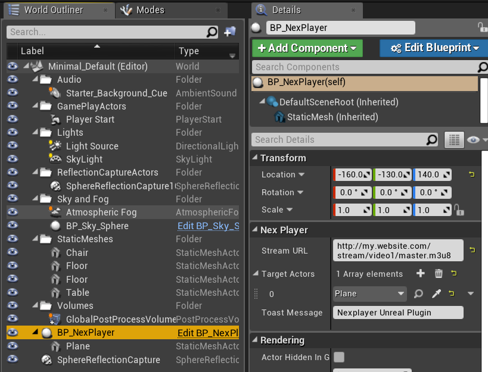</img> 

 Play the scene, and you will see your video rendering on the target Actor: 

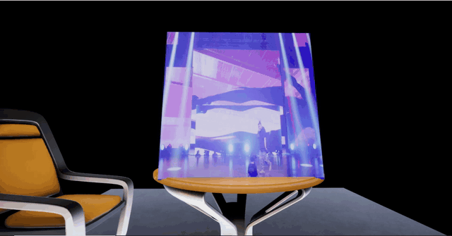</img> 

-------------------

## Contact
[support.madrid@nexplayer.com](mailtosupport.madrid@nexplayer.com)
 +34 914 184 356
